# Prisma Entity Relationship Diagram Generator

Prisma generator to create an ER Diagram every time you generate your prisma client.

```bash
npm i -D prisma-erd-generator
# or
yarn add -D prisma-erd-generator
```

Add to your `schema.prisma`

```json
generator erd {
  provider = "prisma-erd-generator"
}
```

Run the generator

```bash
npx prisma generate
```



## Options

Additional configuration

### Output

Change output type and location

- Usage

  ```json
  generator erd {
    provider = "prisma-erd-generator"
    output = "../ERD.svg"
  }
  ```

- Extensions

  `.svg, .png, .pdf`

  Default: `./prisma/ERD.svg`

### Theme

Theme selection

- Usage

  ```json
  generator erd {
    provider = "prisma-erd-generator"
    theme = "forest"
  }
  ```

- Values

  `default, forest, dark or neutral`

  Default: `default`
